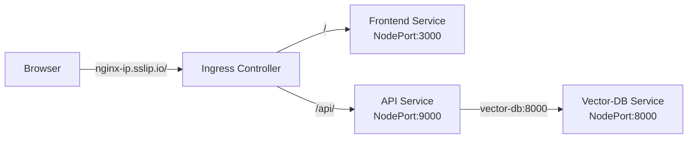
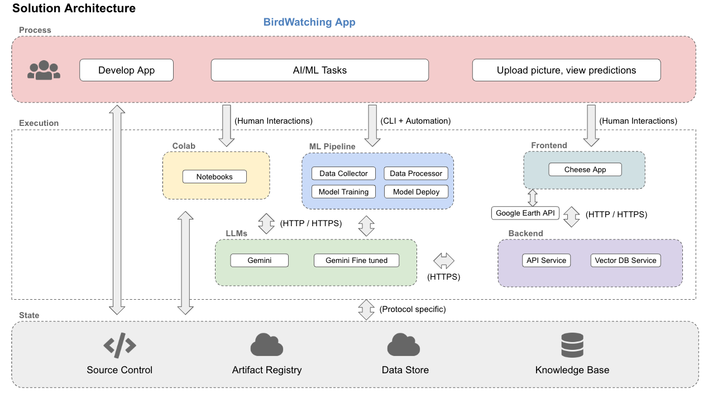
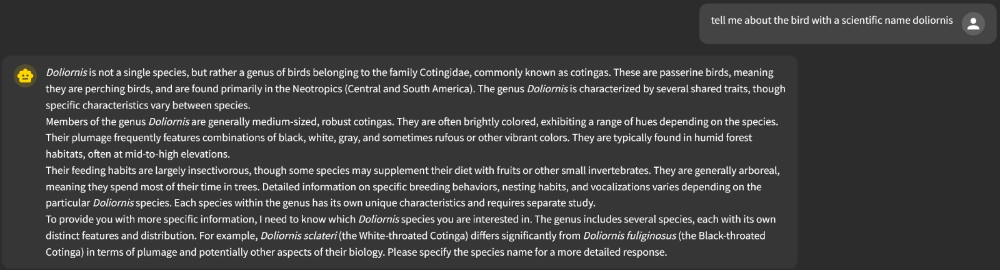

### Internal notes for M5 (please do not delete this paragraph yet): A new birdnet_app folder has been added to the src directory. It contains a complete, self-contained setup for running BirdNET with transfer learning independently. Also, for running vector db: python cli.py --download --chunk --embed --load --chunk_type char-split ###


## Project Milestone 5 - E115 - Birdwatching App
   
#### Project Milestone 5 Organization

```
├── Readme.md
├── images 
├── src
│   ├── vector-db
│   ├── api-service
│   ├── birdnet_app
│   ├── deployment
│   └── frontendreact
├── .github 
│   └── workflows
│       └── data_scraping.yml   
│       └── data_sound_explorer.yml   
│       └── data_maps.yml   
│       └── unit_test.yml   
│       └── integration_test.yml  
│       └── lint.yml 
│       └── deploy.yml 
├── tests   
│   └── test_unit.py
│   └── test_integration.py
├── ansible   
├── kubernetes   
├── notebooks
│   ├── BirdWatchingApp.ipynb
│   ├── Acoustic_Monitoring_EDA.ipynb
│   ├── Interactive_Map_Biodiversity.ipynb
│   ├── Interactive_Map_Bird_Locations.ipynb
│   ├── Interactive_Map_Deforestation.ipynb
│   ├── TransferLearningModel.ipynb
│   ├── SemanticScholar.py
│   ├── cli.py
│   └── preprocess_cv.py
├── references
├── reports
│   ├── FinalPresentation.pdf
│   └── MediumPost(pdf or link)     
```

# E115 - Milestone 5 - Birdwatching App

**Team Members:** Jaqueline Garcia-Yi, Susan Urban, Yong Li, and Victoria Okereke

**Group Name:** Birdwatching App

**Project:**  
This project leverages AI to support bird species identification, using Yanachaga Chemillén National Park in Peru as a case study. The park is home to over 500 bird species, many of which are endemic—found nowhere else in the world. The app is powered by BirdNET, an open-source AI-based acoustic model trained to identify bird species through their vocalizations. To enhance detection capabilities, particularly for rare or underrepresented species that are not yet recognized by BirdNET, we are integrating a custom transfer learning model trained specifically on rare species audio data. The app also features interactive maps enriched with environmental and habitat data, such as deforestation and biodiversity hotspots. Additionally, a large language model (LLM) agent serves as a virtual bird expert, offering detailed information about identified species and answering bird-related queries. This project highlights the integration of AI prediction models, natural language processing, and geospatial data for applications in ecotourism, environmental monitoring, and education.
<br><br>

----

## Continuous Integration and Continuous Deployment (CI/CD) 

**Continuous Integration and Continuous Delivery/Continuous Deployment (CI/CD)** is a set of principles and practices in software development and operations aimed at frequently delivering code changes reliably and efficiently.

## Continuous Integration (CI) ##

The practice of regularly integrating code changes from multiple developers into a shared repository. The main goal is to detect integration issues early by automatically testing and building the code whenever a change is made. CI ensures that the codebase is always in a functional state.

YONG CAN ADD HIS PORTION

### CI Prerequisites: ###

- Developers satisfactorily complete all pylint(python), JSLint(JavaScript), Hadolint(Dockerfile), Black(formatter), and unit tests locally prior to commiting the code.

### CI Setup/Instructions: ###

- Unit test (not activated)
- GitHub action for integration test
- Integration test

## 2. Deployment to GCP ##

### Prerequisites ###

#### API's to enable in GCP #### 
Search for each of these in the GCP search bar and click enable to enable these API's
* Vertex AI API
* Compute Engine API
* Service Usage API
* Cloud Resource Manager API
* Google Container Registry API
* Kubernetes Engine API

#### Setup GCP Service Account 
- To setup a service account, go to [GCP Console](https://console.cloud.google.com/home/dashboard), search for  "Service accounts" from the top search box or go to: "IAM & Admins" > "Service accounts" from the top-left menu and create a new service account called "deployment". 
- Give the following roles:
- For `deployment`:
    - Compute Admin
    - Compute OS Login
    - Container Registry Service Agent
    - Kubernetes Engine Admin
    - Service Account User
    - Storage Admin
    - Vertex AI Administrator
- Then click done.
- This will create a service account.
- On the right "Actions" column click the vertical ... and select "Create key". A prompt for Create private key for "deployment" will appear. Select "JSON" and click create. This will download a private key json file to your computer. Copy this json file into the **secrets** folder.
- Rename the json key file to `deployment.json`
- Follow the same process to create another service account called `gcp-service`
- For `gcp-service` give the following roles:
    - Storage Object Viewer
    - Vertex AI Administrator
- Then click done.
- This will create a service account.
- On the right "Actions" column click the vertical ... and select "Create key". A prompt for Create private key for "gcp-service" will appear select "JSON" and click create. This will download a Private key json file to your computer. Copy this json file into the **secrets** folder.
- Rename the json key file to `gcp-service.json`

### Setup Docker Container (Ansible, Docker, Kubernetes)

Use Docker to build and run a standard container with all of the required software.

#### Run `deployment` container
- cd into `deployment`
- Go into `docker-shell.sh` and change `GCP_PROJECT` to your project id
- Run `sh docker-shell.sh` 

- Check versions of tools:
```
gcloud --version
ansible --version
kubectl version --client
```

- Check to make sure you are authenticated to GCP
- Run `gcloud auth list`

The Docker container connects to your GCP and can create VMs and deploy containers all from the command line.


### SSH Setup
#### Configuring OS Login for service account
Run this command within the `deployment` container
```
gcloud compute project-info add-metadata --project <YOUR GCP_PROJECT> --metadata enable-oslogin=TRUE
```
example: 
```
gcloud compute project-info add-metadata --project ac215-project --metadata enable-oslogin=TRUE
```

#### Create SSH key for service account
```
cd /secrets
ssh-keygen -f ssh-key-deployment
cd /app
```

### Providing public SSH keys to instances
```
gcloud compute os-login ssh-keys add --key-file=/secrets/ssh-key-deployment.pub
```
From the output of the above command keep note of the username. Here is a snippet of the output 
```
- accountId: ac215-project
    gid: '3906553998'
    homeDirectory: /home/sa_100110341521630214262
    name: users/deployment@ac215-project.iam.gserviceaccount.com/projects/ac215-project
    operatingSystemType: LINUX
    primary: true
    uid: '3906553998'
	...
    username: sa_100110341521630214262
```
The username is `sa_100110341521630214262`

### Deployment Setup
* Add ansible user details in inventory.yml file
* GCP project details in inventory.yml file
* GCP Compute instance details in inventory.yml file
* Replace project to your GCP project id in inventory_prod.yml
* Replace project to your GCP project id in docker-shell.sh


### Deployment

#### Build and Push Docker Containers to Google Artifact Registry
```
ansible-playbook deploy-docker-images.yml -i inventory.yml
```

#### Create Compute Instance (VM) Server in GCP
```
ansible-playbook deploy-create-instance.yml -i inventory.yml --extra-vars cluster_state=present
```

Get the IP address of the compute instance from the GCP Console and update the appserver>hosts in the inventory.yml file

#### Provision Compute Instance in GCP
Install and setup for deployment.
```
ansible-playbook deploy-provision-instance.yml -i inventory.yml
```

#### Setup Docker Containers in the  Compute Instance
```
ansible-playbook deploy-setup-containers.yml -i inventory.yml
```

SSH into the server from the GCP console and see the status of the containers
```
sudo docker container ls
sudo docker container logs api-service -f
sudo docker container logs frontend-react -f
sudo docker container logs nginx -f
sudo docker contaier logs birdnet_app -f
```

To get into a container run:
```
sudo docker exec -it api-service /bin/bash
```

#### Configure Nginx file for Web Server
* Create the nginx.conf file for defaults routes in the web server

#### Setup Webserver on the Compute Instance
```
ansible-playbook deploy-setup-webserver.yml -i inventory.yml
```
Once the command runs go to `http://<External IP>/` 

## **Delete the Compute Instance / Persistent disk**
```
ansible-playbook deploy-create-instance.yml -i inventory.yml --extra-vars cluster_state=absent
```

## Deployment with Scaling using Kubernetes

In this section deploy the BirdWatching app to a K8s cluster

### API's to enable in GCP for Project
Search for each of these in the GCP search bar and click enable to enable these API's
* Vertex AI API
* Compute Engine API
* Service Usage API
* Cloud Resource Manager API
* Google Container Registry API
* Kubernetes Engine API

### Start Deployment Docker Container
-  `cd deployment`
- Run `sh docker-shell.sh` or `docker-shell.bat` for windows
- Check versions of tools
`gcloud --version`
`kubectl version`
`kubectl version --client`

- Confirm authentication to GCP
- Run `gcloud auth list`

### Build and Push Docker Containers to GCR
**This step is only required if you have NOT already done this**
```
ansible-playbook deploy-docker-images.yml -i inventory.yml
```

### Create & Deploy Cluster
```
ansible-playbook deploy-k8s-cluster.yml -i inventory.yml --extra-vars cluster_state=present
```

This is how the various services communicate between each other in the Kubernetes cluster.



### Try some kubectl commands
```
kubectl get all
kubectl get all --all-namespaces
kubectl get pods --all-namespaces
```

```
kubectl get componentstatuses
kubectl get nodes
```

### If you want to shell into a container in a Pod
```
kubectl get pods --namespace=cheese-app-cluster-namespace
kubectl get pod api-5d4878c545-47754 --namespace=cheese-app-cluster-namespace
kubectl exec --stdin --tty api-5d4878c545-47754 --namespace=cheese-app-cluster-namespace  -- /bin/bash
```

### View the App
* Copy the `nginx_ingress_ip` from the terminal from the create cluster command
* Go to `http://<YOUR INGRESS IP>.sslip.io`

---

## Create Kubernetes Cluster 

### Create Cluster
```
gcloud container clusters create test-cluster --num-nodes 2 --zone us-east1-c
```

### Checkout the cluster in GCP
* Go to the Kubernetes Engine menu item to see the cluster details
    - Click on the cluster name to see the cluster details
    - Click on the Nodes tab to view the nodes
    - Click on any node to see the pods running in the node
* Go to the Compute Engine menu item to see the VMs in the cluster

### Try some kubectl commands
```
kubectl get all
kubectl get all --all-namespaces
kubectl get pods --all-namespaces
```

```
kubectl get componentstatuses
kubectl get nodes
```

### Deploy the App
```
kubectl apply -f deploy-k8s-tic-tac-toe.yml
```

### Get the Loadbalancer external IP
```
kubectl get services
```

### View the App
* Copy the `External IP` from the `kubectl get services`
* Go to `http://<YOUR EXTERNAL IP>`

## Setup GitHub Action Workflow Credentials

Setup credentials in GitHub to perform the following functions in GCP:
* Push docker images to GCR
* Run Vertex AI pipeline jobs
* Update kubernetes deployments 

### Setup
* Go to the repo Settings
* Select "Secrets and variable" from the left side menu and select "Actions"
* Under "Repository secrets" click "New repository secret"
* Give the Name as "GOOGLE_APPLICATION_CREDENTIALS"
* For the Secret copy+paste the contents of your secrets file `deployment.json` 

**Continuous Deployment (CD):** This takes the automation a step further by automatically deploying code changes to production after they pass all the automated tests in the deployment pipeline. This approach allows for a rapid release cycle and is commonly used in scenarios where rapid deployment and iteration are essential.


### Frontend & Backend Changes

A GitHub Action builds and deploys a new version of the app when a git commit has a comment `/run-deploy-app`

* Open the file `src` / `api-service` / `api` / `service.py`
* Update the version in line 29:
```
@app.get("/status")
async def get_api_status():
    return {
        "version": "3.1",
    }
```
* Open the file `src` / `frontend-react` / `src` / `services` / `Common.js`
* Update the version in line 3:
```
export const APP_VERSION = 2.5;
```

To change the background color of the header in the frontend.
* Open the file `src` / `frontend-react` / `src` / `components` / `layout` / `Header.jsx`
* Update the background color in line 69 to `bg-sky-700`:
```
className={`fixed w-full top-0 z-50 transition-all duration-300 ${isScrolled ? 'bg-sky-700' : 'bg-transparent'
```

To run the deploy app action, add the following to code commit comment:
**Do this outside the container**
* Add `/deploy-app` to the commit message to re-deploy the frontend and backend 

```
git add .
git commit -m "update frontend and backend version and header color /deploy-app"
git push
```

### ML Component Changes

To run Vertex AI Pipelines on code commits, add the following to code commit comment:
* Add `/run-ml-pipeline` to the commit message to run the entire Vertex AI ML pipeline
* Add `/run-data-collector` to the commit message to run the data collector ML pipeline
* Add `/run-data-processor` to the commit message to run the data processor ML pipeline

#### View the App (If you have a domain)
1. Get your ingress IP:
   * Copy the `nginx_ingress_ip` value that was displayed in the terminal after running the cluster creation command or from GCP console -> Kubernetes > Gateways, Services & Ingress > INGRESS

   * Example IP: `34.148.61.120`

2. Configure your domain DNS settings:
   * Go to your domain provider's website (e.g., GoDaddy, Namecheap, etc.)
   * Find the DNS settings or DNS management section
   * Add a new 'A Record' with:
     - Host/Name: `@` (or leave blank, depending on provider)
     - Points to/Value: Your `nginx_ingress_ip`
     - TTL: 3600 (or default)

3. Wait for DNS propagation (can take 5-30 minutes)

4. Access your app:
   * Go to: `http://your-domain.com`
   * Example: `http://formaggio.me`

#### View the App (If you do not have a domain)
* Copy the `nginx_ingress_ip` from the terminal from the create cluster command
* Go to `http://<YOUR INGRESS IP>.sslip.io`

* Example: http://35.231.159.32.sslip.io/

<hr style="height:4px;border-width:0;color:gray;background-color:gray">


### Delete Cluster
```
gcloud container clusters delete test-cluster --zone us-east1-c
```

---


## 3. Usage details and examples. ##

Pictures and brief descriptions of examples from above. 

## 4. Known issues and limitations. ##

Issues:

Limitations:

- the number of new birds (not already contained within the birdnet training set) is limited but will be growing with greater engagement with the Yanachaga Chemillén National Park staff in the future. The transfer learning capability is in place and can be easily extended with future additions. 

## 5. Notebooks and Reports ##
Pylint

JSlint

Hadolint

Unit Test

Integration Test

**a. Final Presentation (PDF)**


**b. Medium Blog Post (Link)**


## MATERIAL FROM PREVIOUS MILESTONE 4 ##

## Milestone4 ##

In this milestone, we have the frontend, API service, components from previous milestones for data management, including versioning, as well as the interactive maps, and acoustic and language models.

After completion of building a robust ML Pipeline in our previous milestone we have built a backend api service and frontend app. This will be our user-facing application that ties together the various components built in previous milestones.


### 1. Application Design ###

Before we start implementing the app we built a detailed design document outlining the application’s architecture. We built a Solution Architecture and Technical Architecture to ensure all our components work together.

Here is our Solution Architecture:



Here is our Technical Architecture:


The architectures follow a state of the art design using enterprise COTS and open source products. A Google Earth API is added in support of the several maps used in the app. 


### 2. Backend API ###

The backend API is built using FastAPI and serves as the core interface between the frontend, the BirdNET model, and the LLM agent. It processes both audio and text inputs and routes them through intelligent workflows designed to enhance the birdwatching experience. It allows audio-based species detection by accepting bird audio recordings and processes them through the BirdNET model to identify the bird species. It also supports natural language inputs from users and sends them to the LLM agent for answers. It wraps BirdNET predictions with informative responses generated by the LLM agent, returning a rich description to the user. The backend API further provides endpoints for checking model status and overall API health.


**2.1. Acoustic Model for Bird Species Identification**

The acoustic model BirdNET is used for identification of bird species by audio recording. The frontend allows an audio file to be uploaded, and the backend api ```llm_cnn_chat``` saves the file in a temperory path and passes the temp file path to the BirdNET model for prediction. 
Key features: 
-   No preprocessing on audio file is required: The BirdNET model uses its built-in preprocessor to chunk the input audio into fixed length (3 or 5 seconds) pieces, and converts each of the small pieces into a spectrogram as an image input to a neural network in BirdNET.
-   Multiple audio formats supported: supports not only .mp3 and .wav, but also .flac
-   Long recording supported: for an audio recording longer than a fixed chunk length, the BirdNET model will generate embeddings and make a prediction on each chunk of data. The audio file size limition is 5MB.
-   Enhanced accuracy with longer data: The prediction on each data chunk is averaged on each species over all chunks. The results are ranked to obtain the prediction with the highest confidence. 
-   Augmented with text query: The api answers a question either when the audio is uploaded or after the model prediction.  The audio input about the species relates to habitat preferences, feeding behaviors and dietary needs, breeding cycles and nesting habits, conservation strategies and threats. 

**2.2. Bird Knowledge Expert (LLM-Agent Chatbot)**

The LLM agent is the conversational layer that brings context and insight to the app. Whether responding to text-based questions or enhancing audio-based bird species predictions, it serves up detailed, accurate, and engaging information.

Key features:
-   RAG-Enhanced Response Generation: The agent uses a Retrieval-Augmented Generation (RAG) architecture. It includes a custom tool that retrieves relevant bird species data from our web-scrapped, chunked, and embedded knowledge base, then injects the retrieved content into the LLM to generate informed, natural responses.
-   Audio Input Pipeline: When an audio file is received, the BirdNET model predicts the most likely species. This prediction is then used as a query to retrieve species information, which the agent uses to craft a natural, informative response.
-   Text Input Support: For direct user questions, the agent dynamically pulls and injects relevant information to respond meaningfully.
-   Tool-Augmented Architecture: Our agent uses the ```get_specie_info_by_search_content``` tool, which filters and ranks the knowledge base content using the cosine similarity against expanded user queries.


### 3. Frontend React ###
The frontend of the application is built as a user-friendly React web interface, designed to enable users to identify bird species through audio recordings and access detailed bird information via an AI agent. The primary functionality centers around integrating with a backend service that hosts a BirdNET-based acoustic model for species prediction and a large language model (LLM) acting as a bird expert assistant.

Users can record or upload bird vocalizations directly through the interface. These audio files are sent to the backend via a RESTful API, which returns prediction results indicating the most likely bird species to the LLM. The frontend then displays this information in a clear and accessible format, enabling users to further explore related content.

The React app is structured into several key sections:

- **Home Page**: Offers an overview of the app’s capabilities and guides users to different features.

  

- **Bird Sound Explorer**: A catalog of local bird species, complete with images and example vocalizations.

  

- **Interactive Maps**: This section presents geospatial visualizations of ecological and environmental data, including historical bird sighting locations, habitat conditions (e.g., forest cover, deforestation), and biodiversity hotspots. 

  

Users can interact with the maps by zooming in/out and toggling between multiple data layers, such as land cover classifications, deforestation patterns, and the boundaries of the protected area. These interactive features enable a deeper spatial understanding of bird habitats and environmental pressures within Yanachaga Chemillén National Park.

                                                                                                  

- **Audio Upload & Chat Interface**: Allows users to submit recordings and engage with the LLM-based chatbot to ask questions and receive context-aware information about the identified bird species and other bird information of their interest.

  The interface allows uploading audios for bird identification:

  

  And getting expert information about birds:

  


### 4. Running Dockerfile ###

**App Containers**

The BirdWatching app requires the setup of three containers:

1. A vector database container 
2. A Python container for the API services
3. A web server container for the frontend

**Prerequisites**

A prerequisite is the installation of Docker. 

Each container will run in isolation but communicate with each other to create the complete BirdWatching application.

**Clone GitHub Repository**

Clone or download the github repository. 

**Create a Local Secrets Folder**

The secrets file is managed outside of GitHub since secure information should be maintained outside of GitHub. 

At the same level as the E115-BirdWatchingApp-Internal folder create a folder called secrets where you will add your service account. 

Your folder structure should look like this:
```
 |-E115-BirdWatchingApp-Internal
     |-images
     |-notebooks
     |-references
     |-reports
     |-src
       |---api-service
       |---frontend-react
       |---vector-db
  |-secrets
```
  
**Setup GCP Service Account**

1. To setup a service account you will need to go to GCP Console, search for "Service accounts" from the top search box or go to: "IAM & Admins" > "Service accounts" from the top-left menu and create a new service account called "ml-workflow". For "Service account permissions" select "Storage Admin", "AI Platform Admin", "Vertex AI Administrator", "Service Account User"
2. This will create a service account
3. On the right "Actions" column click the vertical ... and select "Manage keys". A prompt for Create private key for "ml-workflow" will appear select "JSON" and click create. This will download a Private key json file to your computer. Copy this json file into the secrets folder. Rename the json file to ml-workflow.json

**Vector DB Container**

We will set up and initialize our vector database with bird-related content for Retrieval Augmented Generation (RAG).

Set up the Vector Database:

1. Navigate to the vector-db directory:
   
cd E115—BirdWatchingApp—Internal/src/vector-db

2. Build and run the container:
   
sh docker-shell.sh

3. Initialize the database. Run this within the docker shell:
   
python cli.py --download --load --chunk_type recursive-split

This process will:

- Download the bird knowledge base (chunks + embeddings)
- Load everything into the vector database 

This step is crucial for enabling the bird assistant to provide accurate, knowledge-based responses.

Keep this container running while setting up the backend API service and frontend apps.

**API-Service Container** 

We create a container running a FastAPI-based REST API service.

Setup API-Service:

1. Navigate to API Service Directory
   
cd E115—BirdWatchingApp—Internal/src/api-service

2. Build & Run Container
   
sh docker-shell.sh

3. Review Container Configuration
   
-	Check docker-shell.sh:
-	Port mapping: -p 9000:9000
-	Development mode: -e DEV=1
-	Check docker-entrypoint.sh: Dev vs. Production settings

4. Start the API Service
   
- Run the following command within the docker shell:

uvicorn_server

- Verify the service is running at http://localhost:9000

- Enable API Routes

- Enable All Routes in api/service.py

**Additional routers here**

app.include_router(newsletter.router, prefix="/newsletters")
app.include_router(podcast.router, prefix="/podcasts")
app.include_router(llm_chat.router, prefix="/llm")
app.include_router(llm_cnn_chat.router, prefix="/llm-cnn")
app.include_router(llm_rag_chat.router, prefix="/llm-rag")
app.include_router(llm_agent_chat.router, prefix="/llm-agent")

•	Go to http://localhost:9000/docs and test the newsletters routes
 
**View API Docs**

Fast API gives interactive API documentation and an exploration tool for free.

- Go to http://localhost:9000/docs
- You can test APIs from this tool
 
Keep this container running while setting up the backend API service and frontend apps.

**React Frontend Container**

Setup React Frontend Container:

1. Navigate to the React frontend directory:
   
cd E115—BirdWatchingApp—Internal/src/frontend-react

2. Start the development container:
   
sh docker-shell.sh

3. First time only: Install the required Node packages

npm install

4. Launch Development Server

- Start the development server:
   
npm run dev

- View the app at: http://localhost:3000
   
Note: Make sure the API service container is running for full functionality

**Docker Cleanup**

Make sure you do not have any running containers and clear up an unused images. Complete the following steps: 

1. Run ```docker container ls```

2. Stop any container that is running

3. Run ```docker system prune```

4. Run ```docker image ls```


### 5. Notebooks/Reports ####
This folder contains code that is not part of a container e.g., Application mockup, EDA, any 🔍 🕵️‍♀️ 🕵️‍♂️ crucial insights, reports or visualizations.

**5.1 Web Scrapping and Data Versioning**

We collected bird species information by scraping text from three authoritative websites, along with scholarly articles sourced from Google Scholar and Semantic Scholar. The extracted data was cleaned and structured before being stored in a GCS bucket for use in downstream processing and semantic search.

An initial baseline of both the acoustic data and the LLM-RAG data was collected in March 2025. The data was scraped from the sources mentioned above using custom scripts.

Over the course of several months, additional data may be incorporated into both the acoustic and LLM datasets. However, for the remote sensing model, relevant information such as deforestation changes is typically updated once per year.

Both the acoustic and LLM-RAG datasets are dynamic, with snapshots taken at specific intervals to capture full replacements of the data. As website authors may update or expand the data, these datasets are expected to evolve over time, with content updates occurring over several months.

Previous versions of the models are not expected to be revisited. Given that updates are anticipated to occur every few months, the team will establish the initial baseline and later implement the Data Versioning Container.

**Files:**
- **cli.py**: This script scrapes text and images and stores the data in GCS bucket. It handles the following:
   -   Text Data -> Saved as .txt files in the bird_description folder.
   -   Image Data -> Stored in the bird_images folder.
   -   Audio Data -> Manually added to the acoustic_data folder.
- **preprocess_cv.py**: This script processes the images collected in bird_images by resizing them to 128x128 pixels and uploading the resized images to the resized folder in GCS bucket.
- **semanticscholar.py**: This script scrapes PDF articles from the semantic scholar website.

**5.2 Acoustic Model for Bird Identification**

The notebook demonstrated how the BirdNET model is used to predict bird species from bird audio input. The BirdNET model use its built-in preprocessor to chunk the input audio into fixed length pieces, convert each of small piece into a spectrogram by Short Time Fourier Transformation. The spectrogram is represented in both time and frequency domain, can be treated as "image" data (see Notebook). It passes it to the neural network model BirdNET to generate an embedding. 

So for an audio recording longer than the fixed chunk length, we obtain embeddings and a prediction for each chunk of data. In the notebook, we ranked the prediction result according to the confidence level from high to low. A threshold can be set to decide if the prediction confidence level is acceptable, if not, the embedding generated for the audio file can be passed to the transfer model for evaluation if it is a rare species. 

**Files:**
- **Acoustic_Monitoring_EDA.ipynb**: This notebook discussed the bird song acoustic representation in time, and time-frequency domain as an "image". 

- **BirdWatchingApp.ipynb**: This notebook illustrates how to use the BirdNET model for bird species prediction, and ranking of the result according to the prediction confidence. 

**5.3 Transfer Learning for Identification of Rare Bird Species**   

In this project, we develop a transfer learning approach to classify rare bird species based on audio recordings. The transfer learning workflow begins by preprocessing field recordings, followed by extracting acoustic embeddings using the BirdNET model. These embeddings serve as feature vectors for training lightweight classifiers capable of recognizing underrepresented species such as Doliornis and Hapalopsittaca.

We implement and compare several models—including multinomial logistic regression, K-nearest neighbors (KNN), multilayer perceptrons (MLPs), and a few-shot learning strategy based on cosine similarity. Cross-validation using grouped audio samples ensures robust evaluation without data leakage. The MLP model achieved the best performance, with an average cross-validation accuracy of 0.87. Based on this result, the MLP was retrained on the full dataset for both rare species, and the notebook includes a practical example demonstrating how to use the final model for prediction.

**Files:**
- **TransferLearningModel.ipynb**: This is the main notebook containing the full transfer learning pipeline. Note: GitHub may display it as an "invalid notebook" due to a known glitch that occasionally occurs when exporting notebooks from Google Colab.

- **TransferLearningModel.pdf**: A static PDF version of the notebook is provided for easier viewing directly on GitHub.

**5.4. Interactive Maps**  

Three interactive maps provide complementary geospatial insights into the biodiversity and habitat conditions of Yanachaga-Chemillén National Park, using Earth Engine and Folium (a python interface to Leaflet) for visualization. The **bird location map** displays historical sighting data for selected endemic and rare species, enabling users to explore species distribution patterns within the protected area. The **deforestation map** overlays land cover classifications (ESA WorldCover) and forest loss data (Hansen Global Forest Change), helping users assess environmental pressures on bird habitats. The **biodiversity hotspot map** highlights the Tropical Andes and other global conservation priority regions, showing the park’s position within a high-priority biodiversity corridor. Users can interact with the maps by zooming in/out and toggling between multiple data layers, such as land cover, deforestation, species presence, and park boundaries, supported by custom legends for easy interpretation.

**Files:**
- **InteractiveMapBird_Locations.ipynb**: Displays historical sighting locations of selected bird species within Yanachaga-Chemillén National Park

- **InteractiveMapDeforestation.ipynb**: Visualizes land cover and forest loss data over the protected area

- **InteractiveMapBiodiversity.ipynb**: Highlights global biodiversity hotspots with a focus on the Tropical Andes, showing the park’s placement within a major conservation priority zone


### 6. Work in Progress ####

**6.1 Transfer learning**

As part of ongoing development, the transfer learning model is intended to operate downstream of the primary BirdNET prediction system within the backend of the app. In this envisioned workflow, audio recordings are first processed by BirdNET, which attempts to identify bird species based on its extensive pre-trained acoustic model. If no species is detected with a confidence score above a defined threshold (e.g., 30%), the system will then trigger a secondary evaluation using our custom transfer learning model, which is specifically trained to recognize rare or underrepresented species such as Doliornis sclateri and Hapalopsittaca melanotis.

This two-stage inference chain aims to improve recognition coverage for rare species that are often missed by general models. The transfer learning component is designed to operate on BirdNET-generated embeddings, leveraging a lightweight classifier (e.g., MLP) trained specifically on local field data. Although the model is technically viable, integration into the app's backend is currently limited by package compatibility issues and the existing backend environment. Future work will focus on resolving these conflicts or converting the model to a more interoperable format (e.g., ONNX) to support seamless deployment.


**6.2 Other Topics**

The team identified the following future tasks for development and testing:

1. Update internal code baseline from using cheese to bird naming conventions
2. Problem resolution of an intermittent error for the chat input resulting in an Axios error
3. Implement CI/CD for multiple containers once we complete the lectures on this topic


