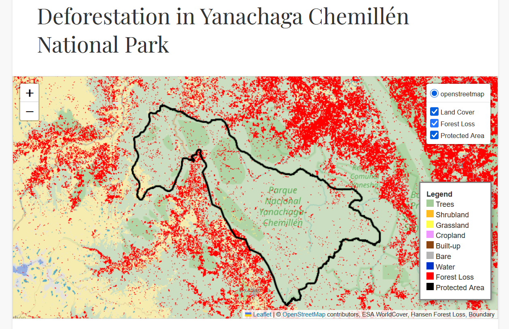
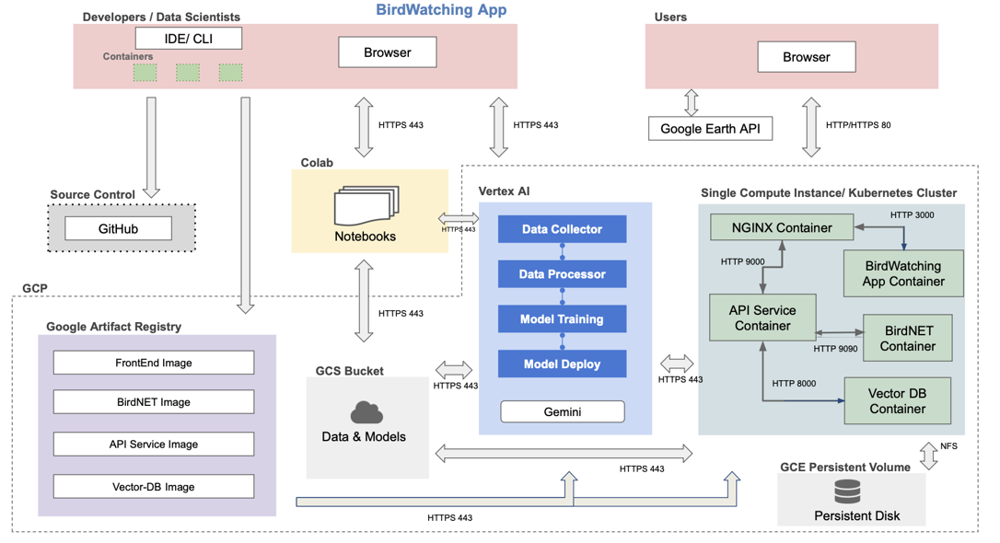

# Final Project - E115 Spring 2025 - Birdwatching App

----
## Final Project Organization

```
├── Readme.md
├── images 
├── src
│   ├── vector-db
│   ├── api-service
│   ├── birdnet_app
│   ├── deployment
│   └── frontend-react
├── .github 
│   └── workflows
│       └── python-test.yml 
│       └── deploy.yml
├── tests (python files of unit and integrations tests)
├── notebooks (see section 8 for explanation and full list)
├── reports (see section 8 for explanation and full list)
├── references
```

**Team Members:** Jaqueline Garcia-Yi, Susan Urban, Yong Li, and Victoria Okereke

**Group Name:** Birdwatching App

**Project Overview:**  
This project leverages AI to support bird species identification, using Yanachaga Chemillén National Park in Peru as a case study. The park is home to over 500 bird species, many of which are endemic—found nowhere else in the world. The app is powered by BirdNET, an open-source AI-based acoustic model trained to identify bird species through their vocalizations. To enhance detection capabilities, particularly for rare or underrepresented species that are not yet recognized by BirdNet, we are integrating a custom transfer learning model trained specifically on rare species audio data. The app also features interactive maps enriched with environmental and habitat data, such as deforestation and biodiversity hotspots. Additionally, a large language model (LLM) agent serves as a virtual bird expert, offering detailed information about identified species and answering bird-related queries. This project highlights the integration of AI prediction models, natural language processing, and geospatial data for applications in ecotourism, environmental monitoring, and education.
<br><br>

----
   
## Table of Contents
### 1.   Introduction
#### 1.1. Problem
#### 1.2.  Solution
### 2. Usage Details  
### 3. Technical Approach
#### 3.1.	Backend Implementation  
##### a) BirdNet + Transfer Learning Model     
##### b) Vector Database (ChromaDB)      
##### c) Agent LLM with RAG Tool     
#### 3.2. 	Frontend Implementation
##### Interactive Maps   
### 4. Deployment and Scaling
#### 4.1. Ansible Deployment
##### a) Prerequisites and Setup Instructions   
##### b) Deployment Instructions   
#### 4.2. Kubernetes Scaling
##### a) Prerequisites and Setup Instructions   
##### b) Deployment Instructions   
### 5. Continuous Integration / Deployment (CI/CD)
##### a) Prerequisites and Setup Instructions   
##### b) Deployment Instructions    
### 6. Impact
### 7. Next Steps / Future Work
### 8. Notebooks and Reports
<br><br>

----
  
## 1. Introduction
      
### 1.1. Problem   
   
Remote, biodiverse places like many national parks in Peru are home to hundreds of unique bird species, yet reliable information about them is often unavailable. Tourists visiting those areas usually lack the tools to explore the local birdlife, missing the chance to connect more deeply with nature.

### 1.2.   Solution   
   
Our solution is a BirdWatching app that uses AI to identify both common and rare species from spectrograms which are visual representations of bird sounds from audio recordings. It also features interactive maps with remote sensing data and includes a built-in LLM agent to answer bird-related questions.
   


## 2.   Usage Details

The app is structured into the following key sections:

- **Home Page**: Offers an overview of the app’s capabilities and guides users to different features.
  

   
- **Bird Sound Explorer**: A catalog of local bird species, complete with images and example vocalizations.
  

   
- **Interactive Maps**: This section presents geospatial visualizations of ecological and environmental data, including historical bird sighting locations, habitat conditions (e.g., forest cover, deforestation), and biodiversity hotspots.
  

    
Users can interact with the maps by zooming in/out and toggling between multiple data layers, such as land cover classifications, deforestation patterns, and the boundaries of the protected area. These interactive features enable a deeper spatial understanding of bird habitats and environmental pressures within Yanachaga Chemillén National Park.
  

  
- **Audio Upload & Chat Interface**: Allows users to submit recordings and engage with the LLM-based chatbot to ask questions and receive context-aware information about the identified bird species and other bird information of their interest.

  The interface allows uploading audios for bird identification:


    
  And getting expert information about birds:
      
#### PLACEHOLDER FOR ADDING GRAPH
  
## 3.   Technical Approach
    
The technical architecture of our BirdWatching app is outlined below, designed to integrate all core components efficiently while ensuring smooth operation across development, deployment, and user-facing functionality. 
        

	  
### 3.1. Backend Implementation   

The backend API is built using FastAPI and serves as the core interface between the frontend, the BirdNET model, and the LLM agent. It processes both audio and text inputs. The backend API further provides endpoints for checking model status and overall API health.
             

     
The backend of our BirdWatching app consists of three core components that work together to identify bird species, manage data, and provide informative responses to user queries:
   
#### a) BirdNet + Transfer Learning Model   
   
At the heart of species identification is a hybrid model architecture that combines BirdNet with a custom-trained transfer learning model. BirdNet serves as the foundational model for recognizing bird calls of common species and also performs the transformation of user-uploaded audio into spectrograms.
To improve identification of rare or region-specific species, we applied transfer learning, a technique where a pre-trained model (like BirdNet) is fine-tuned on a smaller, domain-specific dataset. We tested several models as the transfer learning head, and based on cross-validated performance, the Multilayer Perceptron (MLP) achieved the highest average accuracy. An MLP is a type of fully connected neural network composed of multiple layers of nodes (neurons), which can learn complex patterns in data by passing information through nonlinear activation functions.

The selected MLP head was trained to specialize in distinguishing two rare bird species from Yanachaga-Chemillén National Park in Peru (Doliornis sclateri and Hapalopsittaca melatonis), serving as a focused case study. By combining BirdNet’s robust general-purpose audio classification capabilities with the adaptability of transfer learning, our approach enabled more precise and inclusive identification of region-specific species.
  
Key features: 
- The frontend allows an audio file to be uploaded, and the backend api ```llm_cnn_chat``` saves the file in a temperory path and passes the temp file path to the BirdNET model for prediction. 
-   No preprocessing on audio file is required: The BirdNET model uses its built-in preprocessor to chunk the input audio into fixed length (3 or 5 seconds) pieces, and converts each of the small pieces into a spectrogram as an image input to a neural network in BirdNET.
-   Multiple audio formats supported: supports not only .mp3 and .wav, but also .flac
-   Long recording supported: for an audio recording longer than a fixed chunk length, the BirdNET model will generate embeddings and make a prediction on each chunk of data. The audio file size limition is 5MB.
-   Enhanced accuracy with longer data: The prediction on each data chunk is averaged on each species over all chunks. The results are ranked to obtain the prediction with the highest confidence. 
-   Augmented with text query: The api answers a question either when the audio is uploaded or after the model prediction.  The audio input about the species relates to habitat preferences, feeding behaviors and dietary needs, breeding cycles and nesting habits, conservation strategies and threats. 

    
#### b) Vector Database (ChromaDB)   
   
We utilize a vector database (ChromaDB) to enable fast and semantically meaningful search over bird-related content. The vector container is responsible for extracting, chunking, and embedding information collected via web scraping from trusted sources, which are first stored in a Google Cloud Storage (GCS) bucket.
   
#### c) Agent LLM
The BirdWatching app features a large language model (LLM) agent that assists users with bird-related questions, such as species behavior, habitat, and conservation topics. Rather than relying solely on pre-trained knowledge, the LLM is enhanced with a Retrieval-Augmented Generation (RAG) capability.
When a user submits a query, the LLM can invoke the vector database as a tool, retrieving semantically relevant content from ChromaDB based on embeddings generated from curated, web-scraped sources. This retrieved context is used to improve the factual accuracy and specificity of the LLM’s responses, enabling it to deliver expert-level answers that are grounded in trusted birdwatching resources.
   
Key features:
-   RAG-Enhanced Response Generation: The agent uses a Retrieval-Augmented Generation (RAG) architecture. It includes a custom tool that retrieves relevant bird species data from our web-scrapped, chunked, and embedded knowledge base, then injects the retrieved content into the LLM to generate informed, natural responses.
-   Audio Input Pipeline: When an audio file is received, the BirdNET model predicts the most likely species. This prediction is then used as a query to retrieve species information, which the agent uses to craft a natural, informative response.
-   Text Input Support: For direct user questions, the agent dynamically pulls and injects relevant information to respond meaningfully.
-   Tool-Augmented Architecture: Our agent uses the ```get_specie_info_by_search_content``` tool, which filters and ranks the knowledge base content using the cosine similarity against expanded user queries.

   
### 3.2    Frontend Implementation
The frontend of the BirdWatching App was developed using React, providing a clean, responsive, and intuitive user interface. The layout is structured into three main sections, all accessible from the Home Page through vertical scrolling or navigation links: (1) Bird Assistant, (2) Bird Sound Explorer, and (3) Interactive Maps.
 

The Bird Assistant is an interactive feature that allows users to identify bird species and ask follow-up questions. It supports three input modes: audio-only, text-only, and combined audio-text. Once a user uploads an audio recording of a bird call, the assistant processes it using our backend acoustic models and displays the predicted species. Users can then engage in a conversation about the bird, for instance, asking about its behavior, habitat, or conservation status, with memory of previous interactions preserved across sessions.
 

The Bird Sound Explorer provides an audio-visual gallery of local and endemic birds from Yanachaga-Chemillén National Park, our pilot region in Peru. Each entry includes a high-quality image of the bird and a playable audio recording of its call. This feature is designed to help users familiarize themselves with the sounds and appearances of birds they may encounter in the field.
   
Key features: 
   - The primary functionality centers around integrating with a backend service that hosts a BirdNET-based acoustic model for species prediction and a large language model (LLM) acting as a bird expert assistant.
- Users can record or upload bird vocalizations directly through the interface. These audio files are sent to the backend via a RESTful API, which returns prediction results indicating the most likely bird species to the LLM. The frontend then displays this information in a clear and accessible format, enabling users to further explore related content.


#### Interactive Maps
The Interactive Maps section of the BirdWatching App provides users with environmental and ecological context to enhance their birdwatching experience. Built using Leaflet for map rendering and the Google Earth Engine API for accessing remote sensing data, the maps are fully interactive, allowing users to pan, zoom, and toggle data layers for a more customized view.
 
Three maps are currently available: (1) a species observation map that shows previously recorded bird sightings within Yanachaga-Chemillén National Park, (2) a deforestation map that visualizes forest loss across the region using remote sensing data, and (3) a biodiversity hotspot overlay that highlights areas of high ecological value. Together, these maps help users locate birding hotspots, understand habitat changes, and appreciate the park’s significance as a conservation area.

## 4. Deployment and Scaling
Our application is deployed on Google Cloud Platform (GCP) using a hybrid approach that combines Ansible for virtual machine-based deployment and Kubernetes for scalable container orchestration. Docker containers for all core services, including (1) frontend, (2) API service, (3) vector database, and a (4) combined BirdNet and transfer learning model, were built and pushed to Google Container Registry (GCR) before deployment.

### 4.1. Ansible Deployment
We use Ansible Playbooks to automate the deployment process onto GCP Virtual Machines (VMs). The deployment pipeline consists of the following steps:    
(1) Authentication & Configuration: Secrets, SSH keys, and an inventory.yml file are configured for secure remote provisioning.    
(2) Containerization: Docker images for the vector-db, api-service, frontend-react and combined birdnet and transfer learning model are built locally, tagged with timestamps, and pushed to GCR for version control.    
(3) VM Provisioning: A GCP VM is created with a mounted persistent disk and configured to allow HTTP (port 80) and HTTPS (port 443) traffic for web access.   
(4) Service Deployment:    
- GCP credentials are mounted to the VM.
- Docker containers are pulled from GCR and run on dedicated ports (8000 for vector-db, 9000 for the API, 9090 for combined birnet and transfer learning model, and 3000 for the frontend).
 - A separate Nginx container is configured as a reverse proxy, routing external traffic on port 80 to the correct internal services.
This setup results in a fully functional, publicly accessible application hosted via the VM’s external IP address.

### a) Prerequisites:
- See report Prerequisites and Setup for Deployment to GCP Using Ansible Playbooks
  
### b) Deployment Instructions:
**Build and Push Docker Containers to Google Artifact Registry**
```
ansible-playbook deploy-docker-images.yml -i inventory.yml
```

**Create Compute Instance (VM) Server in GCP**
```
ansible-playbook deploy-create-instance.yml -i inventory.yml --extra-vars cluster_state=present
```

**Provision Compute Instance in GCP**    

Install and setup for deployment.
```
ansible-playbook deploy-provision-instance.yml -i inventory.yml
```

**Setup Docker Containers in the  Compute Instance**
```
ansible-playbook deploy-setup-containers.yml -i inventory.yml
```
   
**Setup Webserver on the Compute Instance**
```
ansible-playbook deploy-setup-webserver.yml -i inventory.yml
```

**View the App**

Once the command runs go to `http://<External IP>/` to see the App

**Delete the Compute Instance / Persistent disk**
```
ansible-playbook deploy-create-instance.yml -i inventory.yml --extra-vars cluster_state=absent
```

 
### 4.2. Kubernetes Scaling
For production scalability and fault tolerance, we also deploy the application using a Kubernetes cluster managed via Google Kubernetes Engine (GKE). This approach allows for container orchestration, horizontal scaling, and better resource utilization across services.

This is how the various services communicate between each other in the Kubernetes cluster.


The Kubernetes deployment workflow includes:    

(1) Cluster Setup:
- A GKE cluster is created with autoscaling enabled (1–2 nodes, n2d-standard-2 with 30 GB disk).
- A dedicated namespace is created for clean resource management.
   
(2) Infrastructure Configuration:
- Nginx Ingress is installed using Helm for managing external access.
- Persistent Volume Claims (PVCs) are configured for long-term storage needs, particularly for ChromaDB.
   
(3) Security and Secrets:
GCP credentials are securely imported into Kubernetes as secrets for authenticated resource access.
    
(4) Service Deployment:   
- The frontend, API, combined birdnet and transfer learning model, and ChromaDB services are deployed using Kubernetes manifests.
- A Kubernetes Job preloads necessary data into ChromaDB during setup.
   
(5) Routing and Access:   
NodePort services are configured, and the Ingress routes incoming traffic to the appropriate endpoints:
            / → Frontend
            /api/ → API service
An external ingress IP is generated, making the app accessible at http://<Ingress IP>.sslip.io.
   
**Pre-requisites and Setup**    

If not previously completed, search for each of these in the GCP search bar and click enable to enable these API's:
* Vertex AI API
* Compute Engine API
* Service Usage API
* Cloud Resource Manager API
* Google Container Registry API
* Kubernetes Engine API

**Deployment Instructions**   
-  `cd deployment`
- Run `sh docker-shell.sh` or `docker-shell.bat` for windows

**Build and Push Docker Containers to GCR**   

This step is only required if you have NOT already done this
```
ansible-playbook deploy-docker-images.yml -i inventory.yml
```

**Create & Deploy Cluster**
```
ansible-playbook deploy-k8s-cluster.yml -i inventory.yml --extra-vars cluster_state=present
```

**Create Kubernetes Cluster**

```
gcloud container clusters create test-cluster --num-nodes 2 --zone us-east1-c
```

**View the App**

* Copy the `nginx_ingress_ip` from the terminal from the create cluster command
* Go to `http://<YOUR INGRESS IP>.sslip.io`

* Example: http://35.231.159.32.sslip.io/

<hr style="height:4px;border-width:0;color:gray;background-color:gray">

**Delete Cluster**
```
gcloud container clusters delete test-cluster --zone us-east1-c
```

## 5. Continuous Integration / Deployment (CI/CD)

We leverage GitHub Actions to automate our continuous integration and deployment (CI/CD) pipeline. On every push, workflows can be triggered to automatically build and deploy containers, virtual machines (VMs), and API endpoints. Additional workflows enforce code quality by running linters, unit tests, and integration tests. This helps to ensure consistent standards and catching issues early whenever changes are made to the codebase. The main goal is to detect integration issues early by automatically testing before building the code whenever a change is made. CI helps to ensure that the codebase is always in a functional state.

**CI/CD Prerequisites:**
- Developers satisfactorily complete all pylint(python), ESLint(JavaScript), Hadolint(Dockerfile), Black(formatter), and unit tests locally prior to commiting the code.
- Setup credentials in GitHub to perform the following functions in GCP:
* Push docker images to GCR
* Run Vertex AI pipeline jobs
* Update kubernetes deployments 
- Go to the repo Settings
* Select "Secrets and variable" from the left side menu and select "Actions"
* Under "Repository secrets" click "New repository secret"
* Give the Name as "GOOGLE_APPLICATION_CREDENTIALS"
* For the Secret copy+paste the contents of your secrets file `deployment.json` 

**CI/CD Setup/Instructions:**

- Unit test (see report instructions_for_unit_integration_test.pdf)
- Integration test (see report instructions_for_unit_integration_test.pdf)
- GitHub action for integration test (check action on the python-test.yml)

**Example of CI/CD Frontend & Backend Changes**

See the [`reports/`](/reports/CICD_and_Kubernetes_Scaling.pdf) for our example implementation of a GitHub Action.


## 6. Impact
Our Bird Watching app is built to address a critical gap in eco-tourism and conservation: the lack of accessible tools for identifying and learning about unique bird species in remote, biodiverse regions. National parks in Peru and similar areas are home to hundreds of rare and endemic bird species, yet reliable, localized information about them is scarce—especially for tourists and casual observers.
By transforming audio recordings into spectrograms and using AI to identify bird species, our app empowers travelers to explore the natural world around them with confidence, even in areas where traditional field guides or expert support are unavailable. This opens up a new level of interaction with nature, turning passive sightseeing into active, informed discovery.
The app’s interactive maps, enriched with remote sensing data, help users navigate diverse habitats and locate bird hotspots in real-time, while the built-in LLM agent provides instant, context-aware answers to bird-related questions—from identifying species behaviors to understanding their ecological significance.
Beyond personal enrichment, the app has significant value for local guides, educators, and conservationists, offering a powerful, accessible tool to enhance tours, support environmental education, and even contribute observational data for research and biodiversity monitoring.
By making advanced bird identification technology available on a smartphone, our app helps bridge the gap between nature and technology—turning remote, under-documented ecosystems into spaces of discovery, learning, and conservation for a broader global audience.

## 7. Next Steps / Future Work
We are considering the following improvements to enhance the app’s functionality and better user experience:
-   Mobile Responsiveness: Given that most users will access the app via mobile devices, it is crucial to ensure full mobile responsiveness. This includes optimizing performance for a seamless experience across various screen sizes and network conditions (3G, 4G, 5G).
-   Advanced Species Identification: Future development will incorporate both audio detection and image recognition to improve bird species identification. By leveraging APIs such as GPT or Gemini, image-based inputs can enhance the accuracy and reliability of species detection.
-   Noise Reduction in Audio: Real-world bird call recordings often contain background noise from wind, water, or other environmental sources. Implementing audio preprocessing techniques to reduce such interference can significantly improve model prediction accuracy.
 - Expanded Species Coverage: The current transfer learning model supports only two rare bird species. With additional training data, the model can be extended to recognize a broader range of rare species, increasing its overall utility and impact.
-  Advanced Visualization Features: For professional and research-focused users, we could offer features such as prediction confidence scores combined with spectrogram visualizations. These tools would provide deeper insights into acoustic patterns and support more detailed analysis.

## 8.  Notebooks and Reports ####
This folder contains code that is not part of a container e.g., application mockup, EDA, any crucial insights, reports or visualizations.

### 8.1 Web Scrapping and Data Versioning

We collected bird species information by scraping text from three authoritative websites, along with scholarly articles sourced from Google Scholar and Semantic Scholar. The extracted data was cleaned and structured before being stored in a GCS bucket for use in downstream processing and semantic search.

An initial baseline of both the acoustic data and the LLM-RAG data was collected in March 2025. The data was scraped from the sources mentioned above using custom scripts.

Over the course of several months, additional data may be incorporated into both the acoustic and LLM datasets. However, for the remote sensing model, relevant information such as deforestation changes is typically updated once per year.

Both the acoustic and LLM-RAG datasets are dynamic, with snapshots taken at specific intervals to capture full replacements of the data. As website authors may update or expand the data, these datasets are expected to evolve over time, with content updates occurring over several months.

Previous versions of the models are not expected to be revisited. Given that updates are anticipated to occur every few months, the team will establish the initial baseline and later implement the Data Versioning Container.

**Files:**
- **cli.py**: This script scrapes text and images and stores the data in GCS bucket. It handles the following:
   -   Text Data -> Saved as .txt files in the bird_description folder.
   -   Image Data -> Stored in the bird_images folder.
   -   Audio Data -> Manually added to the acoustic_data folder.
- **preprocess_cv.py**: This script processes the images collected in bird_images by resizing them to 128x128 pixels and uploading the resized images to the resized folder in GCS bucket.
- **semanticscholar.py**: This script scrapes PDF articles from the semantic scholar website.

### 8.2 Acoustic Model for Bird Identification

The notebook demonstrated how the BirdNET model is used to predict bird species from bird audio input. The BirdNET model use its built-in preprocessor to chunk the input audio into fixed length pieces, convert each of small piece into a spectrogram by Short Time Fourier Transformation. The spectrogram is represented in both time and frequency domain, can be treated as "image" data (see Notebook). It passes it to the neural network model BirdNET to generate an embedding. 

So for an audio recording longer than the fixed chunk length, we obtain embeddings and a prediction for each chunk of data. In the notebook, we ranked the prediction result according to the confidence level from high to low. A threshold can be set to decide if the prediction confidence level is acceptable, if not, the embedding generated for the audio file can be passed to the transfer model for evaluation if it is a rare species. 

**Files:**
- **Acoustic_Monitoring_EDA.ipynb**: This notebook discussed the bird song acoustic representation in time, and time-frequency domain as an "image". 

- **BirdWatchingApp.ipynb**: This notebook illustrates how to use the BirdNET model for bird species prediction, and ranking of the result according to the prediction confidence. 

### 8.3 Transfer Learning for Identification of Rare Bird Species

In this project, we develop a transfer learning approach to classify rare bird species based on audio recordings. The transfer learning workflow begins by preprocessing field recordings, followed by extracting acoustic embeddings using the BirdNET model. These embeddings serve as feature vectors for training lightweight classifiers capable of recognizing underrepresented species such as Doliornis and Hapalopsittaca.

We implement and compare several models—including multinomial logistic regression, K-nearest neighbors (KNN), multilayer perceptrons (MLPs), and a few-shot learning strategy based on cosine similarity. Cross-validation using grouped audio samples ensures robust evaluation without data leakage. The MLP model achieved the best performance, with an average cross-validation accuracy of 0.87. Based on this result, the MLP was retrained on the full dataset for both rare species, and the notebook includes a practical example demonstrating how to use the final model for prediction.

**Files:**
- **TransferLearningModel.ipynb**: This is the main notebook containing the full transfer learning pipeline. Note: GitHub may display it as an "invalid notebook" due to a known glitch that occasionally occurs when exporting notebooks from Google Colab.

- **TransferLearningModel.pdf**: A static PDF version of the notebook is provided for easier viewing directly on GitHub.

### 8.4. Interactive Maps

Three interactive maps provide complementary geospatial insights into the biodiversity and habitat conditions of Yanachaga-Chemillén National Park, using Earth Engine and Folium (a python interface to Leaflet) for visualization. The **bird location map** displays historical sighting data for selected endemic and rare species, enabling users to explore species distribution patterns within the protected area. The **deforestation map** overlays land cover classifications (ESA WorldCover) and forest loss data (Hansen Global Forest Change), helping users assess environmental pressures on bird habitats. The **biodiversity hotspot map** highlights the Tropical Andes and other global conservation priority regions, showing the park’s position within a high-priority biodiversity corridor. Users can interact with the maps by zooming in/out and toggling between multiple data layers, such as land cover, deforestation, species presence, and park boundaries, supported by custom legends for easy interpretation.

**Files:**
- **InteractiveMapBird_Locations.ipynb**: Displays historical sighting locations of selected bird species within Yanachaga-Chemillén National Park

- **InteractiveMapDeforestation.ipynb**: Visualizes land cover and forest loss data over the protected area

- **InteractiveMapBiodiversity.ipynb**: Highlights global biodiversity hotspots with a focus on the Tropical Andes, showing the park’s placement within a major conservation priority zone

### 8.5. Linters
Pylint, ESLint, and Hadolint were employed to ensure code quality across the backend, frontend, and Docker configurations. Pylint was used to enforce PEP 8 standards and identify common Python issues such as unused imports, undefined variables, and inconsistent formatting. Several of the issues flagged by Pylint were addressed and corrected in the codebase. ESLint was applied to the React-based frontend to check for syntax errors, deprecated patterns, and adherence to best practices in JavaScript/TypeScript development. Hadolint was used to evaluate Dockerfiles for security, efficiency, and compliance with container best practices. While no major errors were found by ESLint or Hadolint, their suggestions, primarily stylistic, will be considered in future versions of the app. All linting results are documented in the reports.
   
**Files:**
- **PylintCurrentResultsForApp.pdf**: pylint results of current python code
  
- **HadolintCurrentResultsApp.pdf**: Hadolint results of current dockerfile code
  
- **ESlintCurrentResultsApp.pdf**: ESlint results of current frontend code (JavaScript)
    

### 8.6. Unit Test
The unit test will test each individual functions in birdnet_app container in isolation with mocked dependencies. In the unit test, we use simulated audio input instead of real one. Below are all test cases in unit test, and the instruction to run unit test is shown in the report listed below. 
  1.	Audio Preprocessing: (a) Test padding of short audio. (b) Test of long audio over limit (c) Test handling of invalid audio
  2.	BirdNET Analysis:  (a) Test successful detection  (b) Test no detection case.  (c) Test error handling
  3.	Custom Model Classification:  (a) Test known species detection. (b) Test unknown species case
  4.	Full Pipeline:  (a) Test BirdNET primary path. (b)Test fallback to custom model

**Files:**
- **test_unit.py**: covers all unit test cases list above to verify the functionality of all functions in the birdnet_app container. 

- **instructions_for_unit_integration_test.pdf**: Explain the unit test in details and the instructions to run the test_unit.py by pytest.

### 8.7. Integration Test
The integration test will test the interaction between functions. In the integration test, both simulated and real audio input can be used during the test, but real audio inputs are commonly used. Below are all test cases in the integration test, and the instruction to run the test is shown in the report listed below.
1.	Test the full pipeline with real audio: Verify the entire workflow from audio upload to species prediction
2.	API integration test with real request: Test the FastAPI endpoint with real HTTP call and actual audio processing
3.	Test edge cases in integration: Verify real-world scenarios that unit test might miss
4.	Cross-validate BirdNET and Custom model: Ensure both models agree on simple case as it expected
5.	Performance testing: Check if the system meets real-time requirement

**Files:**
- **test_integration.py**: covers all integration test cases (with real audios) listed above to verify the interaction between functions in birdnet_app. 

- **test_integration_mock.py**: covers all integration test cases (with simulated audios) listed above to verify the interaction between functions in birdnet_app. 

- **instructions_for_unit_integration_test.pdf**: Explain the unit test in details and the instructions to run the test_integration.py by pytest.


### 8.8. Slides of Final Presentation (PDF)   
The slides of the final presentation in pdf.
   
**File:**  
- **Final_presentation_pdf**


